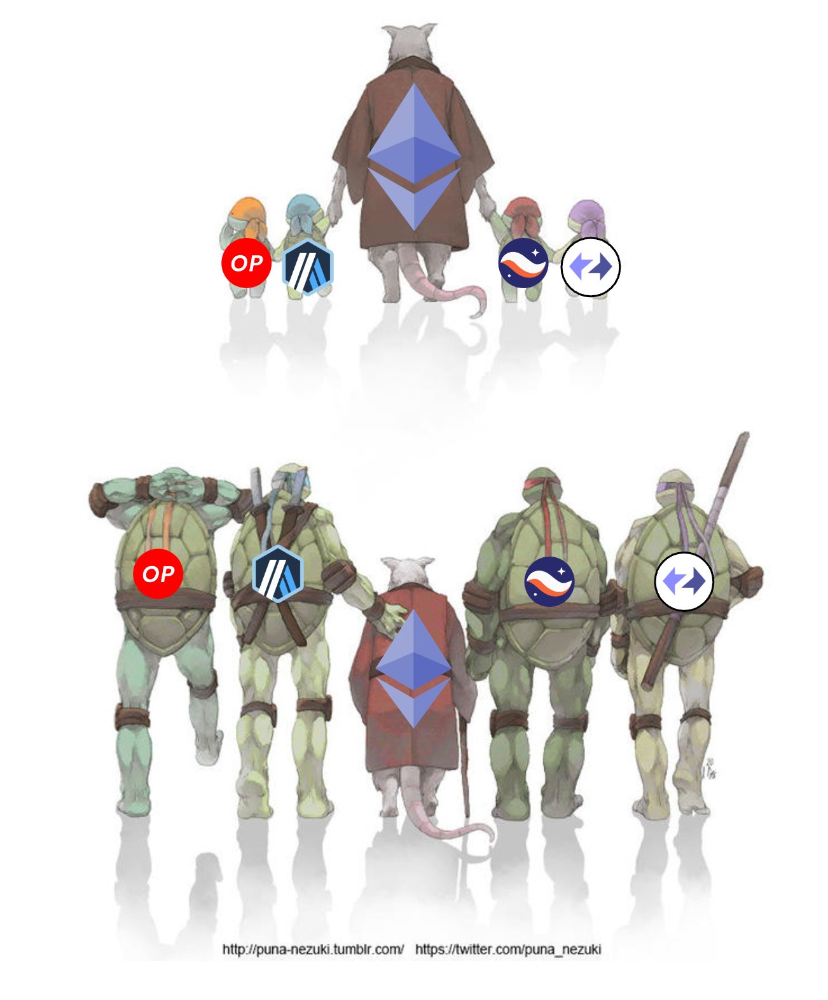

 
  ***L2 Fam: Scaling Ethereum Together***

  

 

Welcome to the **L2 Fam** organization, where we unite to foster the mass adoption of Ethereum. Our mission is clear: to show the world that L2 solutions are not rivals but allies in the quest to scale Ethereum for a better future for all users.

## 🤝 Our Vision

In the so-called "L2 Wars," we find humor and camaraderie. The reality is far from a battleground; it's a community of friends and colleagues. We're a tight-knit group of teams who work side by side in a remarkably small space, sharing laughs, ideas, and visions for a decentralized future.

We celebrate our achievements, large and small, recognizing each step forward as a milestone for Ethereum and a leap toward a future where decentralized solutions are the norm. Today, as we mark yet another huge stride for Ethereum, we invite you to join us in this journey.

## 🚀 Mission

- **Unity Over Competition:** While we enjoy healthy competition as it drives innovation and improvement, we stand together in our core mission to grow Ethereum's cypherpunk values to mainstream acceptance.
- **Collaboration:** We collaborate on standards, safer implementations, and research, fostering an environment where ideas can flourish.
- **Innovation:** Through collective effort, we focus on stimulating and fostering collaborations between L2s on research, standardization, implementations, and prototyping new ideas.

## ❤️ The L2 Fam Spirit

We believe in a future where Ethereum scales seamlessly to meet the demands of the mainstream. Our bonds go beyond professional relationships; we are friends who support and push each other towards mutual goals. The L2 Fam is about growing together, making each other better, and ensuring that Ethereum remains a beacon of innovation and freedom.
